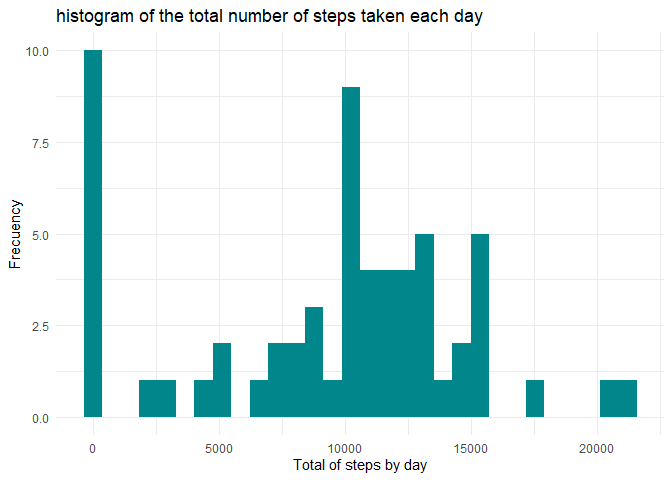
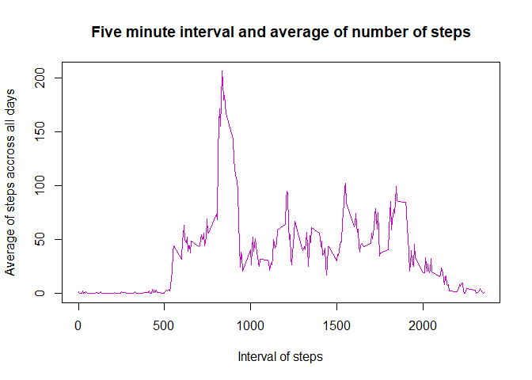
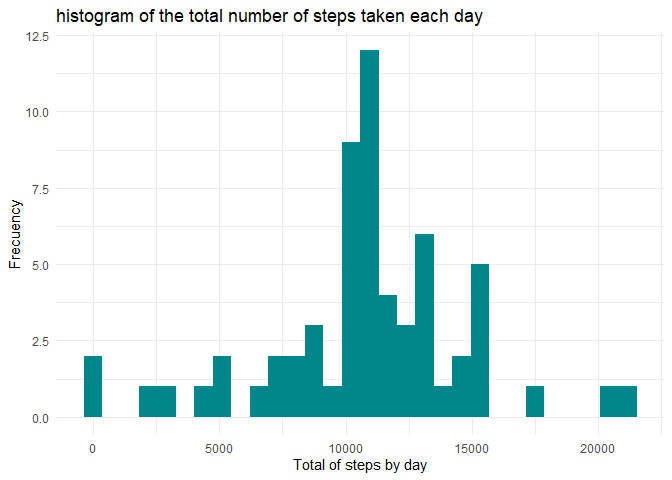
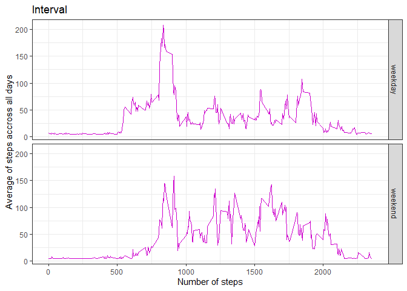

```r
#Load libraries
library(tidyverse)
library(lubridate)
```

## Loading and preprocessing the data

```r
#import data
data <- read.csv("activity.csv", colClasses = c("integer", "character", "integer"))

#Transform date variable

data$date <- lubridate::ymd(data$date)
```

## What is mean total number of steps taken per day?

```r
#Calculate the total number of steps taken per day

data %>% 
  group_by(date) %>% 
  summarise(sum = sum(steps, na.rm = TRUE)) %>% 
  as.data.frame() #This argument is to print all values in HTML
```

```
##          date   sum
## 1  2012-10-01     0
## 2  2012-10-02   126
## 3  2012-10-03 11352
## 4  2012-10-04 12116
## 5  2012-10-05 13294
## 6  2012-10-06 15420
## 7  2012-10-07 11015
## 8  2012-10-08     0
## 9  2012-10-09 12811
## 10 2012-10-10  9900
## 11 2012-10-11 10304
## 12 2012-10-12 17382
## 13 2012-10-13 12426
## 14 2012-10-14 15098
## 15 2012-10-15 10139
## 16 2012-10-16 15084
## 17 2012-10-17 13452
## 18 2012-10-18 10056
## 19 2012-10-19 11829
## 20 2012-10-20 10395
## 21 2012-10-21  8821
## 22 2012-10-22 13460
## 23 2012-10-23  8918
## 24 2012-10-24  8355
## 25 2012-10-25  2492
## 26 2012-10-26  6778
## 27 2012-10-27 10119
## 28 2012-10-28 11458
## 29 2012-10-29  5018
## 30 2012-10-30  9819
## 31 2012-10-31 15414
## 32 2012-11-01     0
## 33 2012-11-02 10600
## 34 2012-11-03 10571
## 35 2012-11-04     0
## 36 2012-11-05 10439
## 37 2012-11-06  8334
## 38 2012-11-07 12883
## 39 2012-11-08  3219
## 40 2012-11-09     0
## 41 2012-11-10     0
## 42 2012-11-11 12608
## 43 2012-11-12 10765
## 44 2012-11-13  7336
## 45 2012-11-14     0
## 46 2012-11-15    41
## 47 2012-11-16  5441
## 48 2012-11-17 14339
## 49 2012-11-18 15110
## 50 2012-11-19  8841
## 51 2012-11-20  4472
## 52 2012-11-21 12787
## 53 2012-11-22 20427
## 54 2012-11-23 21194
## 55 2012-11-24 14478
## 56 2012-11-25 11834
## 57 2012-11-26 11162
## 58 2012-11-27 13646
## 59 2012-11-28 10183
## 60 2012-11-29  7047
## 61 2012-11-30     0
```

```r
#Make a histogram of the total number of steps taken each day

data %>%
  group_by(date) %>%
  summarise(sum = sum(steps, na.rm = TRUE)) %>% #Create variable of sum of steps per day
  ggplot(aes(x = sum)) + #Plot these results
  geom_histogram(fill = "turquoise4") +
  xlab("Total of steps by day") +
  ylab("Frecuency") +
  ggtitle("histogram of the total number of steps taken each day")+
  theme_minimal()
```

<!-- -->

```r
#Calculate and report the mean and median of the total number of steps taken per day

data_report <- 
  data %>%
  group_by(date) %>%
  summarise(sum = sum(steps, na.rm = TRUE)) #Create grouped data frame

report_mean <- mean(data_report$sum, na.rm = TRUE ) #Create integer that gives the mean of the total number of steps taken per day
report_median <- median(data_report$sum, na.rm = TRUE ) #Create integer that gives the mean of the total number of steps taken per day
```

- As we can see, the mean of the total number of steps taken per day is 9354.2295082  
- As we can see, the median of the total number of steps taken per day is 10395


## What is the average daily activity pattern?


```r
# Make a time series plot (i.e. type = "l") of the 5-minute interval (x-axis) and the average number of steps taken, averaged across all days (y-axis)

data %>% 
  group_by(interval) %>% 
  summarise(mean=mean(steps, na.rm = TRUE)) %>% #Calculates the average of every interval
  with(., plot(interval, mean, type="l", col="magenta3", xlab="Interval of steps", ylab="Average of steps accross all days", main="Five minute interval and average of number of steps")) 
```

<!-- -->

```r
#Which 5-minute interval, on average across all the days in the dataset, contains the maximum number of steps?

data_report2 <- 
data %>% 
  group_by(interval) %>% 
  summarise(mean=mean(steps, na.rm = TRUE)) %>% #Calculates the average of every interval
  arrange(desc(mean)) %>% #Aranges value in descending order of the mean
  top_n(1) #Selects the first row
```

The interval, accross all the days in the dataset that contains the maximum number of steps is 835 with a mean of 206.1698113 steps

## Imputing missing values


```r
# Calculate and report the total number of missing values in the dataset (i.e. the total number of rows with NA)
na_tot <- sum(is.na(data[,"steps"]))

# Devise a strategy for filling in all of the missing values in the dataset. The strategy does not need to be sophisticated. For example, you could use the mean/median for that day, or the mean for that 5-minute interval, etc.

#Create a new dataset that is equal to the original dataset but with the missing data filled in.
data_new <- data #create copy
data_new[, "steps"][is.na(data_new[, "steps"])] <-
  mean(data_new[, "steps"], na.rm = TRUE) #this calculates the mean of the steps column and replaces every NA with that value

# Make a histogram of the total number of steps taken each day and Calculate and report the mean and median total number of steps taken per day. Do these values differ from the estimates from the first part of the assignment? What is the impact of imputing missing data on the estimates of the total daily number of steps?

data_new %>%
  group_by(date) %>%
  summarise(sum = sum(steps, na.rm = TRUE)) %>% #Create variable of sum of steps per day
  ggplot(aes(x = sum)) + #Plot these results
  geom_histogram(fill = "turquoise4") +
  xlab("Total of steps by day") +
  ylab("Frecuency") +
  ggtitle("histogram of the total number of steps taken each day")+
  theme_minimal()
```

<!-- -->

The total number of NA's are `na_tot` 
It can be seen that the histogram varies when we input values. The NA's were accumulating all of the steps around the "0" value. The new histogram is more normally distributed.  


## Are there differences in activity patterns between weekdays and weekends?

```r
#Create a new factor variable in the dataset with two levels – “weekday” and “weekend” indicating whether a given date is a weekday or weekend day.

#Create a day variable

data_new$week <-
  ifelse(weekdays(data_new$date) %in% c("domingo", "sábado"),
         "weekend",
         "weekday")

#Make a panel plot containing a time series plot (i.e. type = "l") of the 5-minute interval (x-axis) and the average number of steps taken, averaged across all weekday days or weekend days (y-axis). See the README file in the GitHub repository to see an example of what this plot should look like using simulated data.

data_new %>% 
  group_by(interval, week) %>% 
  summarise(mean=mean(steps, na.rm = TRUE)) %>% #Calculates the average of every interval
  ggplot(aes(x=interval, y=mean))+
  geom_line(col="magenta3")+
  facet_grid(week~.)+
  xlab("Number of steps")+
  ylab("Average of steps accross all days")+
  ggtitle("Interval")+
  theme_bw()
```

<!-- -->

