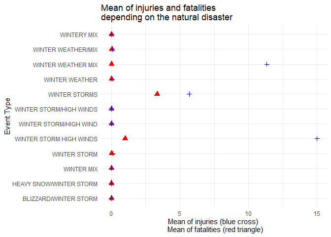
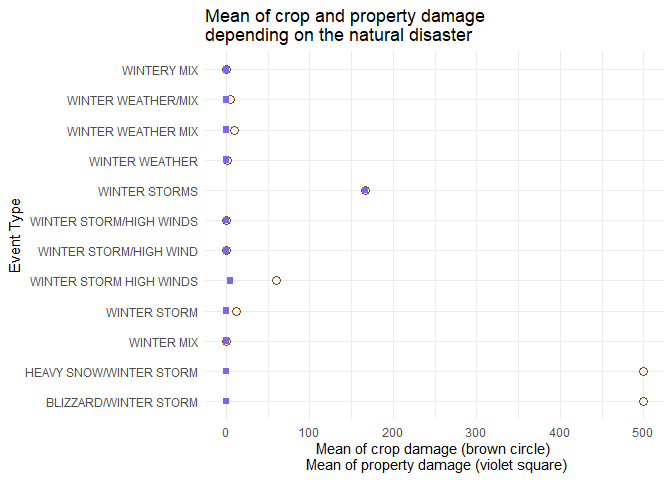

# Synopsis

The purpouse of this analysis is to study the U.S. National Oceanic and Atmospheric Administration's (NOAA) storm database to address which are the most damaging weather events for a country. In this case we will concentrate on the United States.
Specifically, we will address the following questions:
- Across the United States, which types of events are most harmful with respect to population health?
- Across the United States, which types of events have the greatest economic consequences?  
This report is seperated in three parts:  
1. Data preparation  
2. Data processing  
3. Results  
4. Conclusions


# Data preparation

```r
#Load libraries
library(tidyverse)
library(lubridate)
library(janitor)
#import data

download.file("https://d396qusza40orc.cloudfront.net/repdata%2Fdata%2FStormData.csv.bz2","StormData.csv.bz2") #Download file into folder and then you should extract it.
data <- read.csv("StormData.csv")
```

# Data processing 

```r
#Create a copy of the original data set to prevent reloading it in case of any error

data_copy <- data
#data <- data_copy #Uncomment this line in case you commit an error

#clean variable names 
data <- janitor::clean_names(data)
#Transform evtype to character so that we can extract regular expressions
data$evtype <- as.character(data$evtype)

#Select only observations that have a "Storm" expresison on the evtype variable

data <- data %>% filter(grepl("WINTER STORM|WINTER WEATHER|WINTER", evtype))
```

# Results

## With respect to population health

```r
#Create plot that shows the mean of injuries and fatalities by event type

data %>% 
  group_by(evtype) %>% 
  summarise(mean_fatalities=mean(fatalities, na.rm = TRUE),
            mean_injuries=mean(injuries, na.rm = TRUE)) %>% 
  ggplot(aes(x=evtype))+
  geom_point(aes(y=mean_fatalities), col="red", shape=17, size=3)+
  geom_point(aes(y=mean_injuries), col="blue", size=2, shape=3)+
  theme(axis.text.x = element_text(angle = 90, hjust = 1,  vjust = 0.5))+
  coord_flip()+
  ylab("Mean of injuries (blue cross) \n Mean of fatalities (red triangle)")+
  xlab("Event Type")+
  ggtitle("Mean of injuries and fatalities \ndepending on the natural disaster")+
  theme_minimal()
```

<!-- -->


As we can see in the graph, the most deadly event are the Winter Storms (with a mean of 4 deaths). Additionnaly, Winter storms, winter weather and winter storms with high winds are the ones that produce the most injuries in the population.  

## With respect to economic consequences

```r
data %>% 
  group_by(evtype) %>% 
  summarise(mean_prop=mean(propdmg, na.rm = TRUE),
            mean_crop=mean(cropdmg, na.rm = TRUE)) %>% 
  ggplot(aes(x=evtype))+
  geom_point(aes(y=mean_prop), col="saddlebrown", shape=21, size=3)+
  geom_point(aes(y=mean_crop), col="slateblue2", size=2, shape=15)+
  theme(axis.text.x = element_text(angle = 90, hjust = 1,  vjust = 0.5))+
  coord_flip()+
  ylab("Mean of crop damage (brown circle) \n Mean of property damage (violet square)")+
  xlab("Event Type")+
  ggtitle("Mean of crop and property damage \ndepending on the natural disaster")+
  theme_minimal()
```

<!-- -->


As we can see in the graph, the most harmful event for properties are the Winter Storms (with a mean of 150). Additionnaly, the most harmful events for the crops (and in consequence, for the production of food) are the heavy snow and blizzards. This is not surprising as this are the events that produce the lowest temperature damaging the crops.
is the average daily activity pattern?


# Conclusions

As indicated by this brief descriptive analysis of the consecuences of storm events, governments should be prepared to allocate money on the prevention and retention of Winter storms as these are the most harmful on a population's health level and on an economic level. Some money should be spent also on preparing farmers for heavy snow and blizzards as these are the most harmful for the crops.


